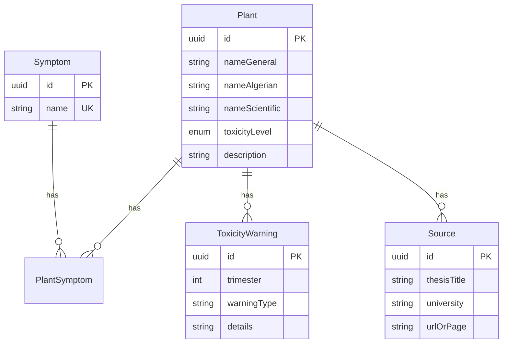

# 🌿 PhytoGrossesse Algérie — Project Foundation

## ✅ What Was Set Up

### Tech Stack (Installed & Configured)
| Technology | Version | Status |
|---|---|---|
| Next.js (App Router) | 16.2.6 | ✅ Running |
| TypeScript | ^5 | ✅ Configured |
| Tailwind CSS | v4 | ✅ Custom theme |
| shadcn/ui | Latest | ✅ Initialized |
| Prisma ORM | Latest | ✅ Schema written |
| PostgreSQL | — | ⏳ Needs connection |

### Database Schema (Prisma)
All models defined in [schema.prisma](file:///c:/Users/pc/Documents/GitHub/PhytoSafeMama/prisma/schema.prisma):



### UI Components Created

| Component | File | Purpose |
|---|---|---|
| `TrafficLightBadge` | [TrafficLightBadge.tsx](file:///c:/Users/pc/Documents/GitHub/PhytoSafeMama/src/components/TrafficLightBadge.tsx) | Color-coded toxicity badge (🟢 Indiqué / 🟡 Prudence / 🔴 Contre-indiqué) |
| `PlantCard` | [PlantCard.tsx](file:///c:/Users/pc/Documents/GitHub/PhytoSafeMama/src/components/PlantCard.tsx) | Displays 3 plant names + badge + description |
| `SearchBar` | [SearchBar.tsx](file:///c:/Users/pc/Documents/GitHub/PhytoSafeMama/src/components/SearchBar.tsx) | Friendly search input with focus animation |
| `SymptomFilter` | [SymptomFilter.tsx](file:///c:/Users/pc/Documents/GitHub/PhytoSafeMama/src/components/SymptomFilter.tsx) | Clickable pill buttons for symptom filtering |
| `NavigationTabs` | [NavigationTabs.tsx](file:///c:/Users/pc/Documents/GitHub/PhytoSafeMama/src/components/NavigationTabs.tsx) | 3-tab navigation (Guide / Maux / Science) |

### Design System
- **Theme**: Warm sage green + soft cream palette (reassuring, natural feel)
- **Font**: [Outfit](https://fonts.google.com/specimen/Outfit) — modern, rounded, friendly
- **Radius**: 0.75rem base with rounded-2xl cards
- **Effects**: Glassmorphism hover, animated pulse dots on badges, gradient hero

## 📸 Live Screenshots

````carousel

<!-- slide -->

````

## 🚀 How to Run

```bash
# Start the dev server
npm run dev

# The app is available at http://localhost:3000
```

## ⏭️ Next Steps

> [!IMPORTANT]
> The database is not yet connected. You need a running PostgreSQL instance.

1. **Connect PostgreSQL** — Update `DATABASE_URL` in `.env` with your PostgreSQL connection string
2. **Run migrations** — `npx prisma migrate dev --name init`
3. **Seed data** — Create a seed script with real plant data from your theses
4. **Wire up API routes** — Create Next.js API routes to fetch plants from DB
5. **Build plant detail page** — Full view with warnings, sources, and trimester info
